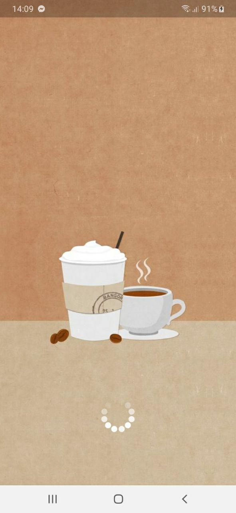
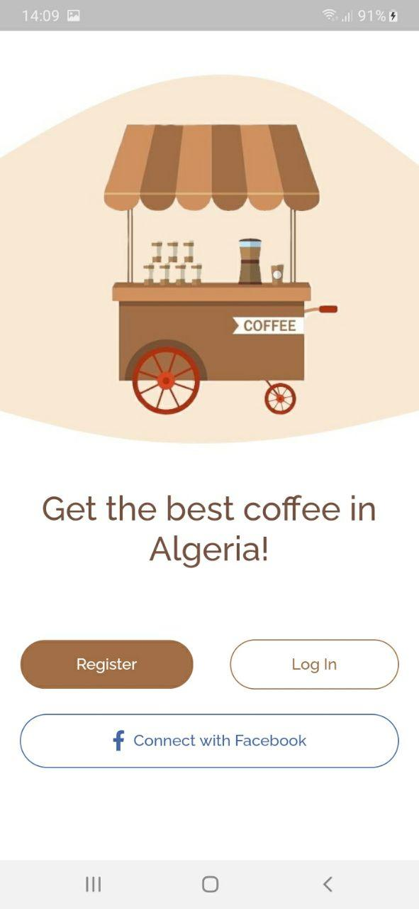
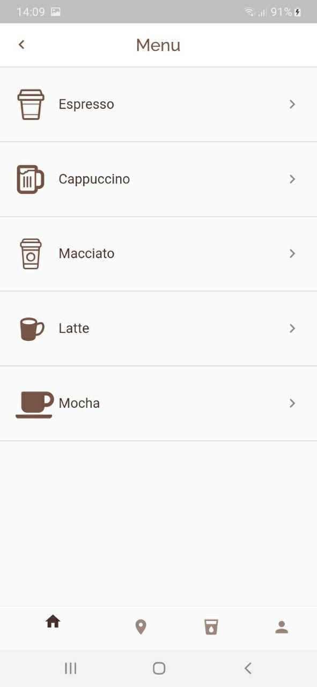
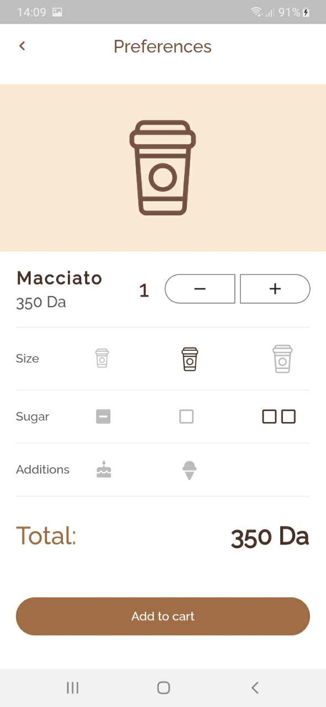

# Jet-Coffee-Shop

## Description:

This is the second app of my challenge (One week challenge), It's a Flutter Application of a CoffeeShop.

## ScreenShots:

    

## Tools & languages:
* Android studio (IDE)
* Dart (logic)
* Flutter (Mobile UI developement kit)
* Paint.net (Image editor)

## Contribution:
Feel free to fork this project and add whatever you like. If you have any suggestions or any comments please feel free to contact me or to open an issue.

## Team:
[Jetlighters](https://github.com/JetLightStudio) having fun.

## Documentation
* [Install Flutter](https://flutter.dev/get-started/)
* [Flutter documentation](https://flutter.dev/docs)

For announcements about new releases and breaking changes, follow the
[flutter-announce@googlegroups.com](https://groups.google.com/forum/#!forum/flutter-announce)
mailing list.

## Special thanks:
Design inspired by [this](https://www.pinterest.com/pin/4714774597826824/) UI
